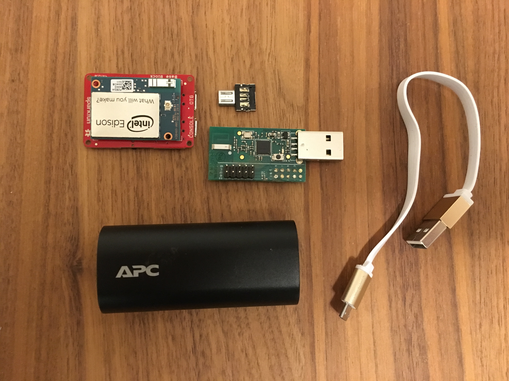
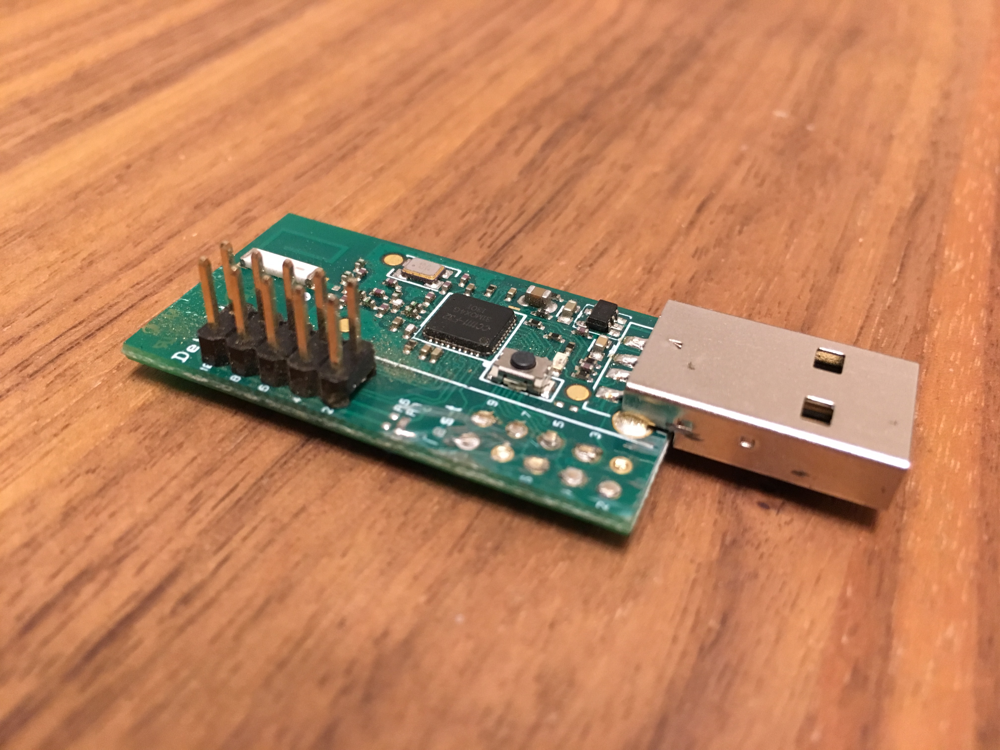
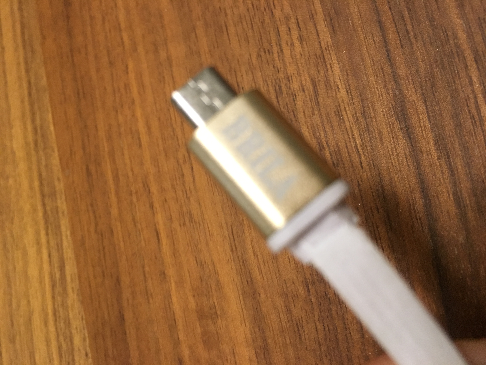
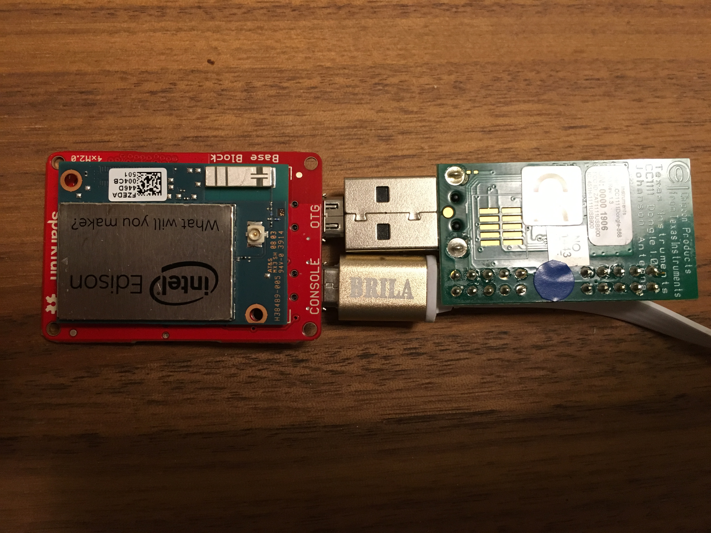
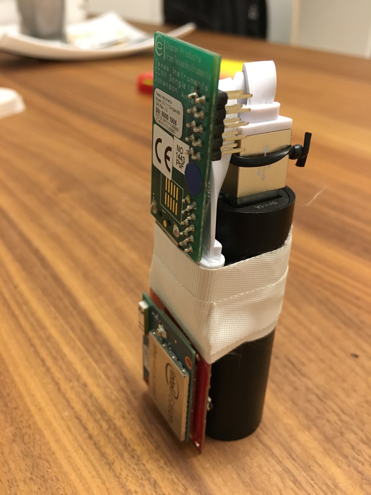
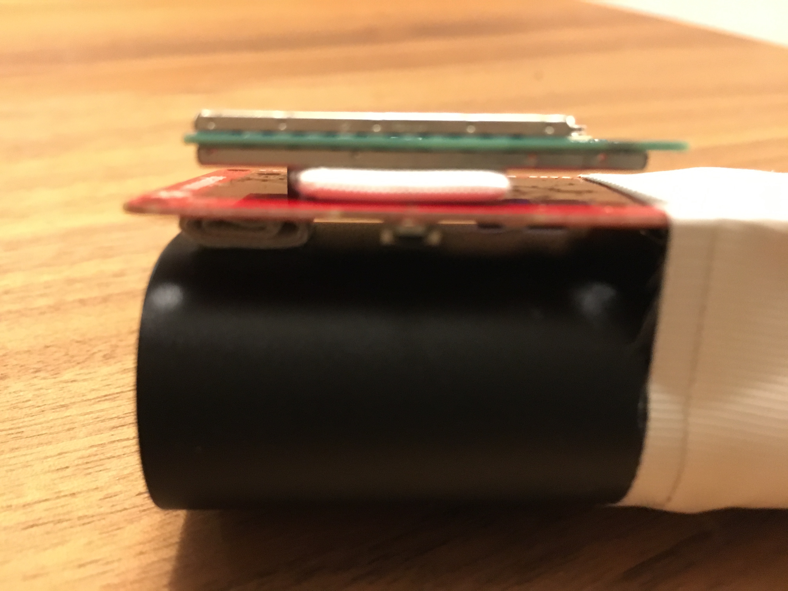
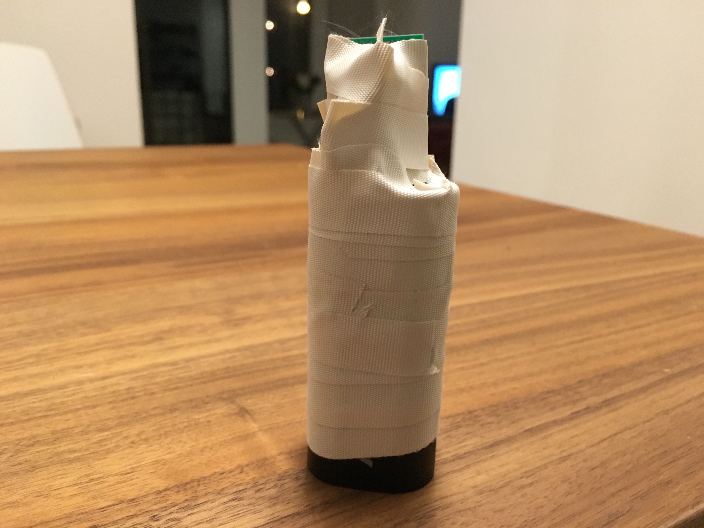
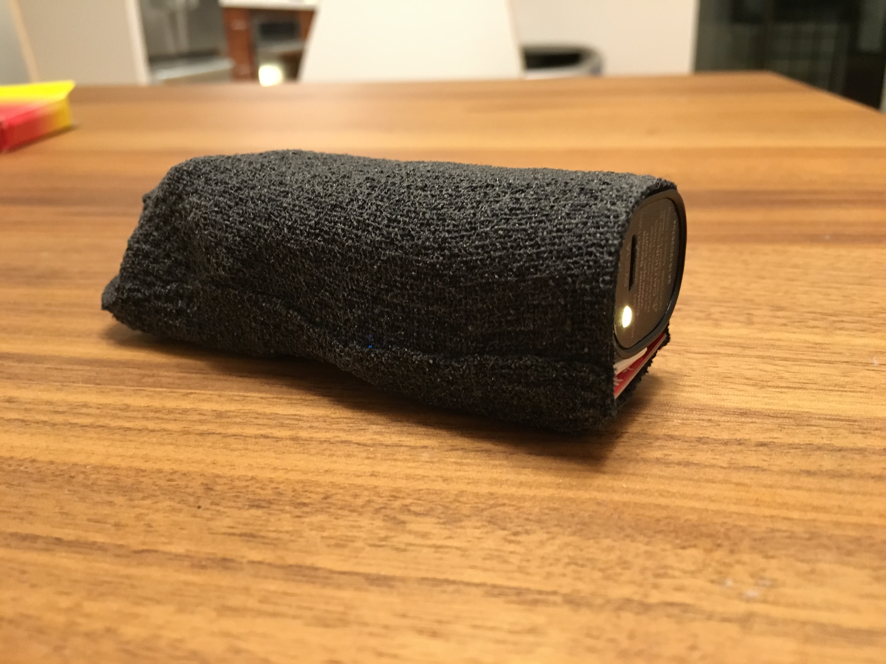
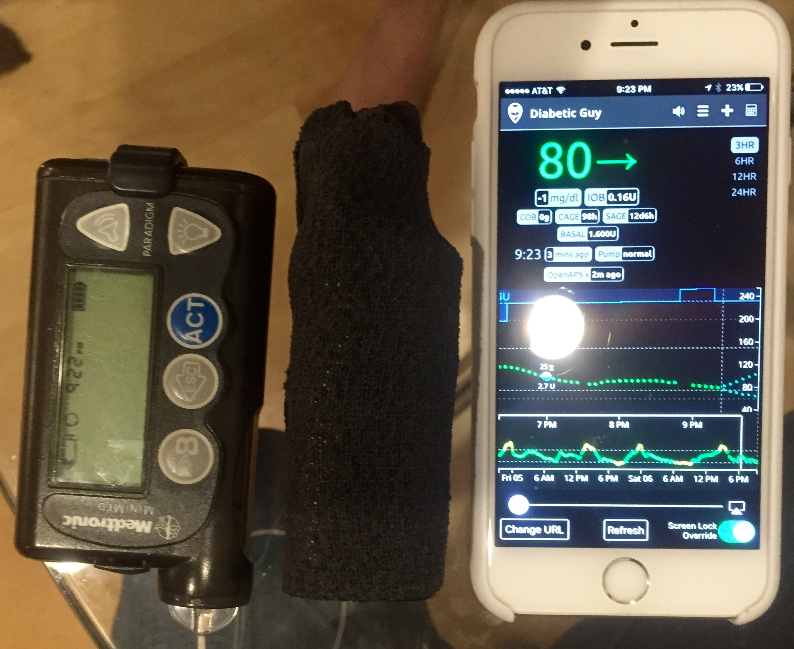

# murselessaps - an openaps implemenation that's small enough for murse avoidance

### Goals
1. Form factors as small as possible, while
2. Not having to use a soldering iron
3. Have  a full day (8-10 hours) of battery life (ok, I wanted longer but that's what I got)

I used a combination of the TI stick, Intel Edison and Sparkfun base board, a battery that has pass-through charging (so you can charger it will keeping your Edison up and running), along with a few other tools and connectors. I was able to order everything from Amazon using Same Day delivery options except the TI Stick and CC Debugger which I got from ti.com. They have default shipping of 2 day air for $7.

There are plenty of other setups to consider, so you should check them out [here](https://github.com/oskarpearson/mmeowlink/wiki) and [here](https://github.com/openaps/docs).

###The process
* [Purchase List](http://amzn.com/w/10OD9UTHX6TTK) - buy this stuff (or something similar)
* [Setting up Edison & TI Stick] (edison-sparkfun-tistick.md)
* My non private configuration and backups are over on [murseless] (https://github.com/jmatheson/murseless)
* Packaging the hardware to fit in your pocket

These are all of the parts that we'll be putting together.

First this I did was take the dremel to the TI-Stick and removed the pins all the way down to the board. Notice that I left the debug pins in place since they were not in the way and we may (but hopefully not) need to flash again later using the debugger.

Second thing I did was use an exacto knife (razor blade) or sharp knife to cut back the edge of micro USB cable. This will give us enough room to plug everything in. Sorry it's blurry.

Next I put the tiny micro usb into the OTG port.
Then I put the white micro usb into the console port.
Then I plugged in the TI stick.
Also plug the Edison into the Sparkfun base board if not already done.

I wrapped up the usb cord and tied it with a twist tie I had from my new dremel packaging. I used the special cloth electrical tape to tape right across the USB device to the battery.

I did not buy any bolt kit from Sparkfun, so instead i rolled up some tape to the right thickness to evenly pad between the edison and the sparkfun, and the sparkfun and the battery.

Then I got a little crazy with the heat tape.

Finally I covered it all with the sports tape I purchased. You can see I left the bottom open so there was a place for a little air flow to the Edison as well as leave the bottom open for pass-through charging of the battery.

The finished product fits right into my pocket and you can see the size here compared to my iPhone6s and pump.

